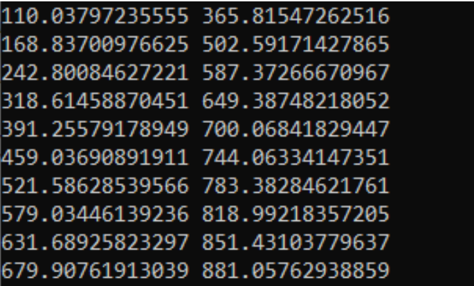
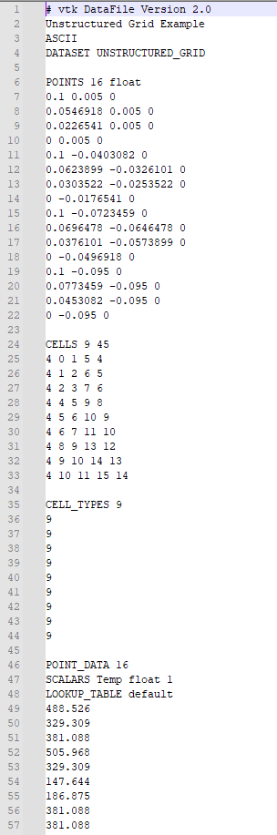
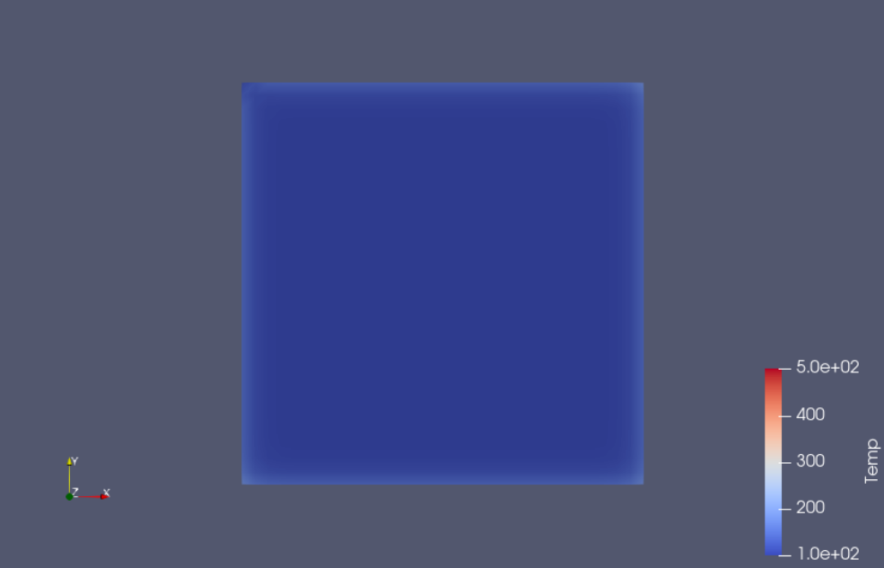
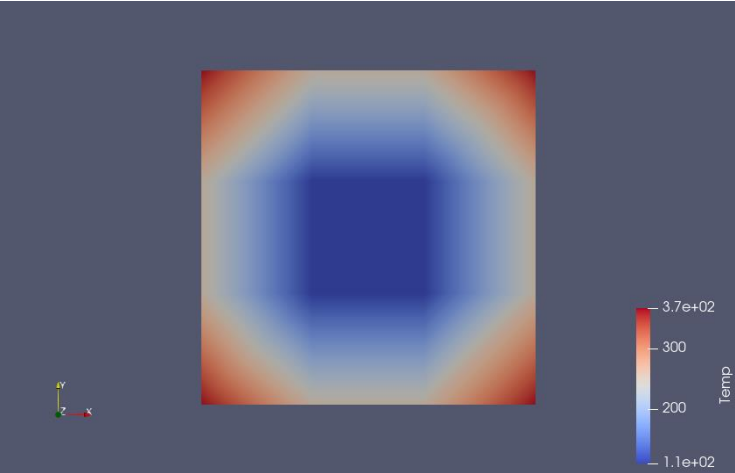
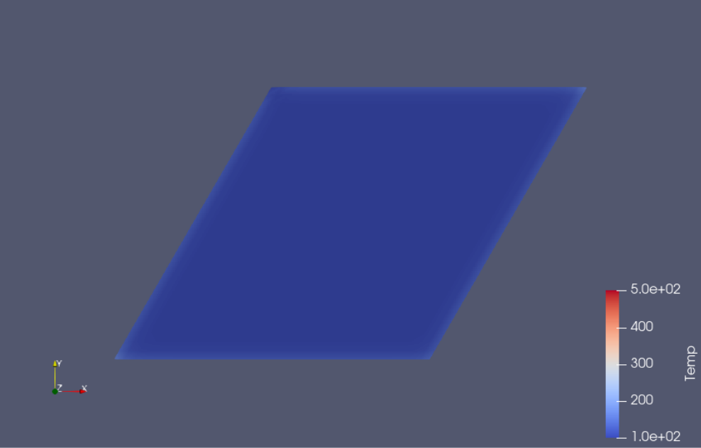
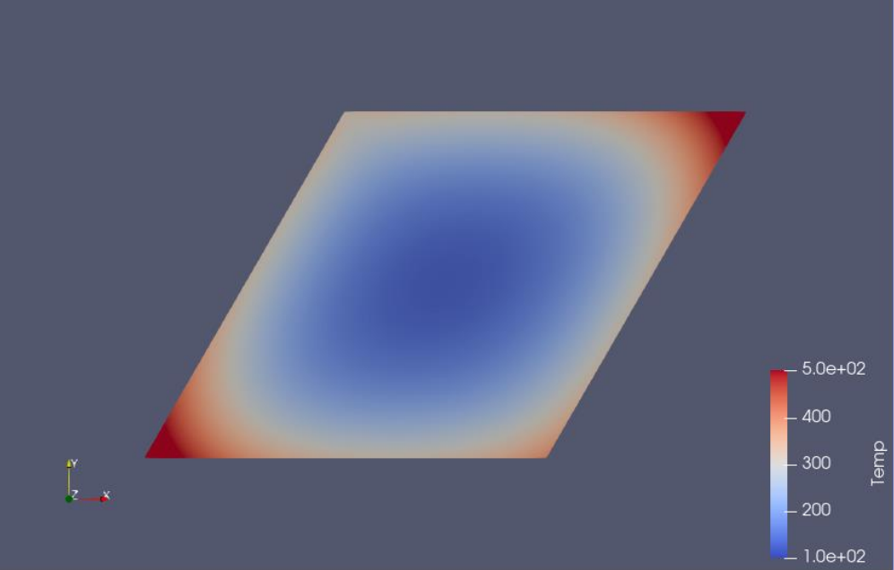

<h1>Finite element method</h1>

## Table of contents
* [Info](#Info)
* [Presentation](#presentation)

## Info
C++ program for FEM calculations. Program calculates temperature in 2D girid and saves ready to use files for ParaView. 

## Presentation

Program shows in console calculated temperatures and saves them in specific format in .vtk file.

Console preview:

Vtk file:

Simulation is changing in time which thanks to our calculations and vtk format we can see it in ParaView. 
We can also set different grid type and size.

Square grid 4x4:

Trapez grid 31x31

